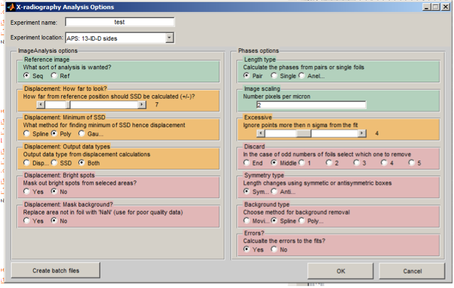

# Analysis Options

This makes Expt_Name.mat which holds all the options for the data analysis. 
Running
```
AnalysisOptions
```
opens the window (illustrated below) which presents the options required by the image analysis scripts. The green highlighted boxes need to be changed for the experiment being analysed, the orange may need to be changed and the red boxes are unlikely to be changed.



The options are: 

* Header rows: 

Option |  Description
------ | ------
Experiment name     | This is the name of the experiment and the name of the saved options file. It has to be the leading string in the image file names, which is usually the experiment name e.g. San_306 
Experiment location | Pull down menu to select the beamline where the experiment was performed. It determines the image pre-processing (rotation, inversions) required. The 'sides' option (where present) is a 90 degree rotation of the images so that displacements of the sides of the foils can be determined.


* ImageAnalysis options:  

These are the options for the ImageAnalysis script that processes the images:-
|Option |  Description |
|------ | ------ |
|Reference ImageAnalysis	| 'Sequence' uses each image and compares it to the following image, moving the reference image as it goes (i.e. image1-image2, image2-image3,…). 'Reference' compares the middle image in the sequence to all the other images (i.e.  image5-image1, …image5-image10).|
|Search distance			| This is the distance (in pixels) that the code calculates the SSD either side of the reference position. The default for the X17B2 / 6-BM-B beamlines is ±5.|
|Minimum SSD				| The method by which the minimum in the SSD is interpolated. The options are ‘spline’, ‘polynomial’, and ‘gaussian’. ‘Spline’ is the usual for rheology experiments and ‘polynamial’ for sinusoidal data sets. |
|Output data				| What files the ImageAnalysis script saves. The ‘displacements’ is the interpolated minimum in the SSD, whilst ‘SSD’ saves all the calculated SSD in a single file. ‘Both’ saves both file types.|
|Bright spots				| If 'yes', this removes the very bright spots from the images. This is used when the images are all black but for the spots so the data cannot be seen. The option was use for the Princeton camera at the X17B2/X17B2ss beamlines which produced 8 bit data within a 12 or 16 bit file.|
|Mask background			| Tries to recognise the regions outside the foil but within the selected box and replaces them with NaN. This removes the effect of these pixels from the analysis. |


* Phases Options: 
These are only needed for anelastic or thermal diffusivity experiments.

Option |  Description
------ | ------
Length type	|Determines how the script combines multiple foils. 'Single' treats each box individually, 'Pair' aligns boxes with the same horizontal position, with more than 2 foils it combines the two outside foils works inwards in pairs. ‘Anelastic’ assumes one box per foil and combines them in series (i.e. 1-2, 2-3, 3-4…)
Image Scaling	| Size of each pixel in microns.
Discard |	If there length type is pair and there are an odd number of foils which one to discard.
Symmetry type	|How to combine the foils for the pair length type. Is the bottom foil switched round?
Background type| 	How to detrend the data before fitting the sinusoid.
Errors	| Save these or not?
